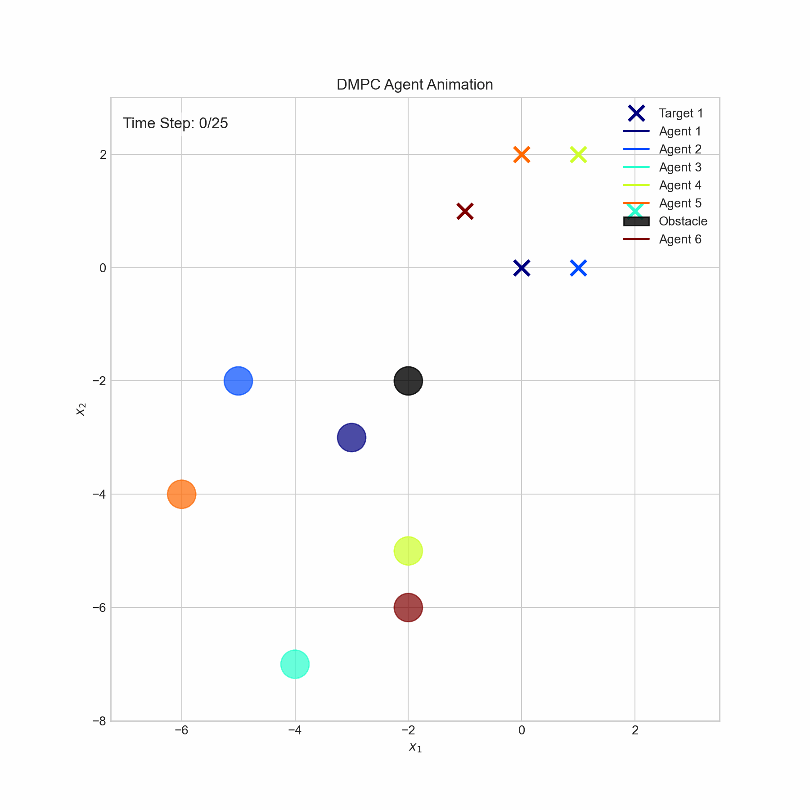
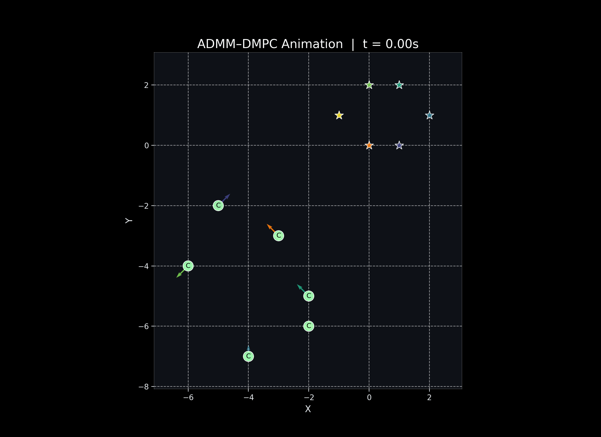

# Collision Avoidance Algorithms Implementation

This repository contains Python implementations of two advanced algorithms for multi-agent coordination and collision avoidance.

## 1. Distributed MPC for Formation and Obstacle Avoidance

**File:** `src/Distributed_MPC_Formation_Obstacle_Avoidance.py`

This implementation is based on the paper **"Distributed MPC for formation of multi-agent systems with collision avoidance and obstacle avoidance"**.

It uses **Distributed Model Predictive Control (DMPC)** to control a group of agents. Each agent solves a local optimization problem to track a desired trajectory while satisfying constraints for:
- **Formation Maintenance**: Keeping relative positions with neighbors.
- **Collision Avoidance**: Maintaining safe distances from other agents.
- **Obstacle Avoidance**: Avoiding static obstacles in the environment.

The solution utilizes **CasADi** and **IPOPT** for solving the nonlinear optimization problems.

### Simulation Result

---

## 2. Fully Decentralized ADMM for Coordination and Collision Avoidance

**File:** `src/Fully_Decentralized_ADMM_Collision_Avoidance.py`

This implementation is based on the paper **"Fully Decentralized ADMM for Coordination and Collision Avoidance"**.

It employs the **Alternating Direction Method of Multipliers (ADMM)** to achieve collision avoidance in a fully decentralized manner. The key features include:
- **Consensus-based Planning**: Agents exchange trajectory proposals to agree on conflict-free paths.
- **Deadlock Resolution**: Includes mechanisms to detect and resolve deadlocks during the coordination process.
- **Heterogeneous Agents**: Supports both cooperative and uncooperative agents.

The implementation uses **CVXPY** for solving the convex sub-problems (QP).

### Simulation Result

